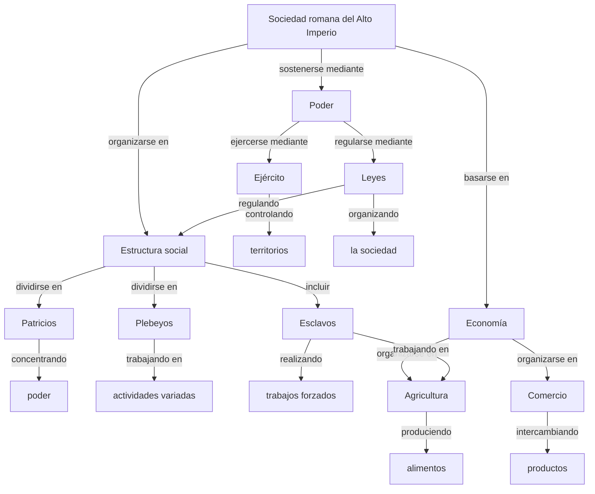

```mermaid
graph TD

A[Sociedad romana del Alto Imperio]

A -->|organizarse en| B[Estructura social]
A -->|basarse en| C[Economía]
A -->|sostenerse mediante| D[Poder]

B -->|dividirse en| B1[Patricios]
B -->|dividirse en| B2[Plebeyos]
B -->|incluir| B3[Esclavos]

B1 -->|concentrando| B1a[poder]
B2 -->|trabajando en| B2a[actividades variadas]
B3 -->|realizando| B3a[trabajos forzados]

C -->|organizarse en| C1[Agricultura]
C -->|organizarse en| C2[Comercio]

C1 -->|produciendo| C1a[alimentos]
C2 -->|intercambiando| C2a[productos]

D -->|ejercerse mediante| D1[Ejército]
D -->|regularse mediante| D2[Leyes]

D1 -->|controlando| D1a[territorios]
D2 -->|organizando| D2a[la sociedad]

B3 -->|trabajando en| C1
D2 -->|regulando| B
```
