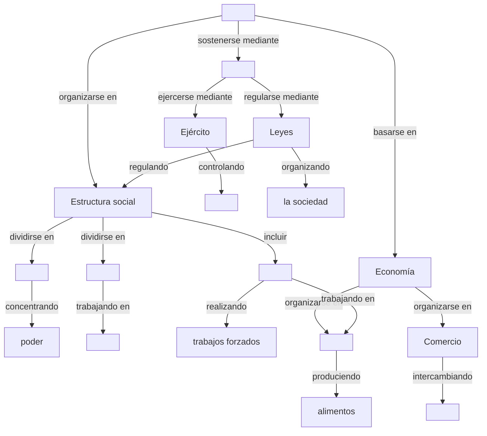

```mermaid
graph TD

A[" "]

%% NIVEL 2
A -->|organizarse en| B[Estructura social]
A -->|basarse en| C[Economía]
A -->|sostenerse mediante| D[" "]

%% NIVEL 3 - SOCIAL
B -->|dividirse en| B1[" "]
B -->|dividirse en| B2[" "]
B -->|incluir| B3[" "]

B1 -->|concentrando| B1a[poder]
B2 -->|trabajando en| B2a[" "]
B3 -->|realizando| B3a[trabajos forzados]

%% NIVEL 3 - ECONOMÍA
C -->|organizarse en| C1[" "]
C -->|organizarse en| C2[Comercio]

C1 -->|produciendo| C1a[alimentos]
C2 -->|intercambiando| C2a[" "]

%% NIVEL 3 - PODER
D -->|ejercerse mediante| D1[Ejército]
D -->|regularse mediante| D2[Leyes]

D1 -->|controlando| D1a[" "]
D2 -->|organizando| D2a[la sociedad]

%% CONEXIONES
B3 -->|trabajando en| C1
D2 -->|regulando| B
```
